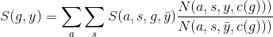
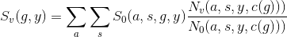
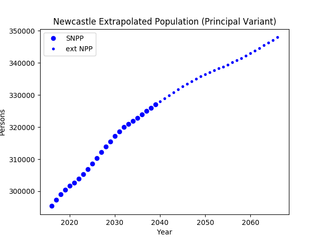
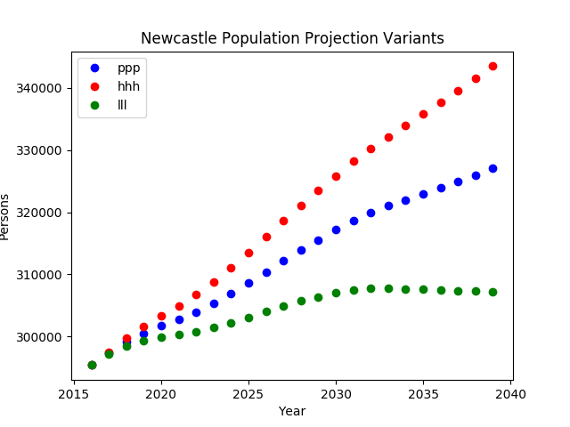
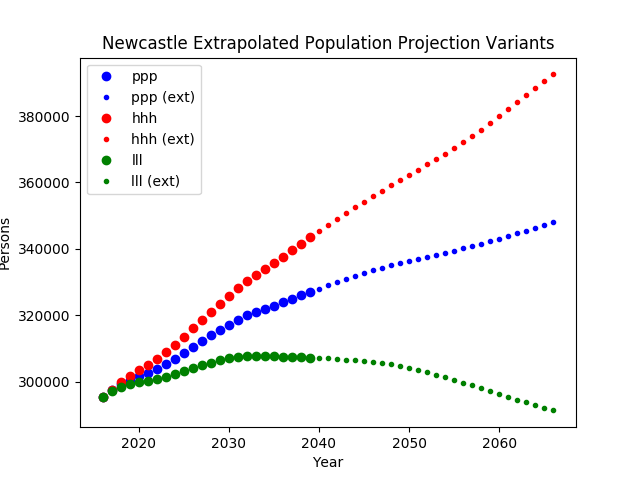
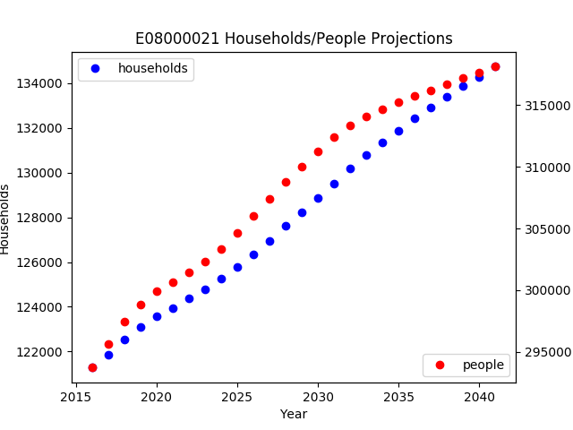

[](https://travis-ci.org/nismod/ukpopulation) [](https://opensource.org/licenses/MIT)
[](http://joss.theoj.org/papers/269be2c1044e902e2cf7716bc9f0f7c0)
[](https://zenodo.org/badge/latestdoi/131988266)
[](https://badge.fury.io/py/ukpopulation)
[](https://anaconda.org/conda-forge/ukpopulation)
[](https://anaconda.org/conda-forge/ukpopulation)


# ukpopulation: UK Demographic Projections

> ## Latest news: 1.1 release
> - adds UK household projections
> - initial support for custom SNPP variants
> - better consistency across the MYE/NPP/SNPP APIs (breaks backwards compatibility)
> - fixes some bugs/issues
> ### Household Projections
> Version 1.1 adds functionality is aggregates household projection data for the UK at LAD (or equivalent level). Each country's statistical agency provides a disaggregation by household type, but as there is little or no consistency between them, no attempt has (yet) been made to provide a UK-wide unified disaggregation. The year ranges mirror the year ranges for the SNPP for each country (see below). Extrapolation, or application of a national projection variant to the data is not provided at this stage.
> ### Custom SNPP Variants
> Given externally-generated data describing variations to an official projection variant, by geography (LAD) and year, this new functionality generates a full SNPP dataset, disaggregated proportionately by age and gender. The custom variant can optionally be forced to nearest-integer values, preserving the original (rounded) total.
> ### API consistency
> The public methods of the `MYEData`, `SNPPData`, `NPPData` and `SNHPData` classes now consistently order arguments: firstly `categories` (where appropriate) then `geogs`, then `years`.

The statistical agencies of the United Kingdom, that is: [ONS](https://www.ons.gov.uk/), [StatsWales](https://statswales.gov.wales/), [NR Scotland](https://www.nrscotland.gov.uk/), and [NISRA](https://www.nisra.gov.uk/), all produce annual population estimates and projection data. Although the data are essentially the same, the quantity, format, and availability varies between agencies and datasets. All of the population projection data is available by (single year of) age and gender. Household projection data is more varied, with each country/agency producing inconsistent disaggregations of households in terms of HRP age and/or household type. For now, this package does not disaggregate by age and leaves the household type disaggregations as-is, which are:

Lowest common denominator | England (ONS)                                       | Wales (StatsWales) | Scotland (NRScotland) | N.Ireland (NISRA)  |
--------------------------|-----------------------------------------------------|--------------------|-----------------------|--------------------|
Single person             | 'One person households: Female'<br>'One person households: Male' |'1 person'|'1 adult: female'<br>'1 adult: male'|'One adult households'|
Adults and children       | 'Households with one dependent child'<br>'Households with three or more dependent children'<br>'Households with two dependent children' | '2 person (1 adult, 1 child)'<br>'3 person (2 adults, 1 child)'<br>'3 person (1 adult, 2 children)'<br>'4 person (2+ adults, 1+ children)'<br>'4 person (1 adult, 3 children)'<br>'5+ person (2+ adults, 1+ children)'<br>'5+ person (1 adult, 4+ children)'| '1 adult 1+ children'<br>'2+ adults 1+ children'| 'One adult households with children'<br>'Other households with children'|
Adults only               | 'Other households with two or more adults'| '2 person (No children)'<br>'3 person (No children)'<br>'4 person (No children)'<br>'5+ person (No children)'| '2 adults'<br>'3+ adults'| 'Two adults without children'<br>'Other households without children'


National population projections (NPP) are the responsibility of ONS who provide the data for each country within the UK, including 15 variants covering a number of possible future scenarios. The current data is based on 2016 population estimates and project a century to 2116.

Subnational population projections (SNPP) are the responsibility of each country's agencies (ONS for England), and project 25 years from a base year that depends on the country in question:

Country          | Latest SNPP year range (as of June 2018) |
-----------------|------------------------------------------|
England          | 2016-2041                                |
Wales            | 2014-2039                                |
Scotland         | 2016-2041                                |
Northern Ireland | 2016-2041                                |

Mid-year population estimates (MYE) are available for the entire UK by local authority, single year of age and gender, from 1991 to 2016 inclusive.

## Projection Coverage

The countries within the UK produce their own SNPP data, and also produce some (patchy) variant projections. The ONS currently regard these (the England ones at least) as ["experimental"](https://www.ons.gov.uk/peoplepopulationandcommunity/populationandmigration/populationprojections/articles/subnationalpopulationprojectionsresearchreportonvariantprojections/2014basedprojections). 

Scenario/Variant                 | Code | E | S | W | N |NPP|
---------------------------------|------|---|---|---|---|---|
Principal                        | ppp  | x | x | x | x | x |
High fertility                   | hpp  | x | x |   |   | x |
Low fertility                    | lpp  |   | x |   |   | x |
High life expectancy             | php  |   | x |   |   | x |
Low life expectancy              | plp  |   | x |   |   | x |
Moderately high life expectancy  | pjp  |   |   |   |   | x |
Moderately low life expectancy   | plp  |   |   |   |   | x |
High migration                   | pph  |   | x |   |   | x |
Low migration                    | ppl  |   | x |   |   | x |
High population                  | hhh  |   |   | x |   | x |
Low population                   | lll  |   |   | x |   | x |
0% future EU migration           | ppq  |   |   |   |   | x |
50% future EU migration          | ppr  |   |   |   |   | x |
150% future EU migration         | pps  |   |   |   |   | x |
Zero net migration               | ppz  | x | x | x |   | x |
Young age structure              | hlh  |   |   |   |   |   |
Old age structure                | lhl  |   |   |   |   |   |
Replacement fertility            | rpp  |   |   |   |   |   |
Constant fertility               | cpp  |   |   |   |   |   |
No mortality improvement         | pnp  |   |   |   |   |   |
No change                        | cnp  |   |   |   |   |   |
Long term balanced net migration | ppb  |   |   | x |   |   |

## Accessibility

[Nomisweb](https://www.nomisweb.co.uk) provides an API which allows relatively easy programmatic access the to data, and by far the preferred source of data. Currently not all the data is available from this source but [this may change](https://www.nomisweb.co.uk/forum/posts.aspx?tID=565&fID=2).

Nomisweb currently hosts the ONS principal NPP data for the UK, the SNPP data for England, and all of the MYE data.

All other data: ONS NPP variants, SNPP data for Wales, Scotland and Northern Ireland are available in different formats from the appropriate agency's website.

# Rationale

The purpose of this package is to provide a unified interface to both SNPP and NPP data, including variants:
- encapsulating the downloading, processing and caching of the NPP and SNPP data from the various sources.
- consistently differentiating by age (single year, up to 90) and gender over the various datasets.
- providing a unified format for all the data.
- providing a method of synthesising SNPP variant projections using SNPP principal and NPP principal/variant projections
- providing a method of extrapolating SNPP data using NPP data
- enabling easy filtering and aggregating of of the data, e.g. extracting projections of the working-age population.

# Methodology and Detail
## Data Sources
- [Nomisweb](https://www.nomisweb.co.uk): UK NPP by country/age/gender, England SNPP by LAD/age/gender, UK MYE by LAD/age/gender.
- [ONS](https://www.ons.gov.uk): UK NPP variants by country/age/gender.
- [Stats Wales](http://open.statswales.gov.wales): Wales SNPP by LAD/age/gender.
- [National Records of Scotland](https://www.nrscotland.gov.uk): Scotland SNPP by LAD equivalent/age/gender.
- [Northern Ireland Statistics and Research Agency](https://www.nisra.gov.uk): Northern Ireland SNPP by LAD equivalent/age/gender.

## Data Processing
- Note that the SNPP for each country, and the NPP data may not have the same reference year. (See table above).
- NPP data is broken down by country (England/Wales/Scotland/Northern Ireland), for all the variant projections indicated in the second table above. 
- Column headings and category values follow the nomisweb/census conventions:
  - `GEOGRAPHY_CODE`: ONS country, LAD, or LAD-equivalent code
  - `GENDER`: 1=Male, 2=Female
  - `C_AGE`: 0-90, where 90 represents 90 or over. To avoid ambiguity, this is an exception - nomisweb census values are typically age+1)
  - `PROJECTED_YEAR_NAME`: 2014-2116   
  - `OBS_VALUE`: count of persons
- All data are cached for swift retrieval.  

# Extrapolation 

The SNPP data can be extrapolated using the longer-term NPP data. This is done independently for each age and gender in order to try to capture the age-gender structure of the original population. Aggregation only takes place  on the extrapolated age-gender specific values. This means that the trends shown by SNPP geographies with different age-gender structures will differ.

If, conversely, the extrapolation was done on the aggregated populations for each SNPP geography, then each SNPP geography would have an identical trend, which would be identical to that of the NPP data.

This methodology can be more formally explained by the following equation for the aggregate SNPP _S(g,y)_ for a given geography and year:



where _N_ is the NPP, _a_ is age, _s_ is gender, _y bar_ is a reference year (typically the final year in the SNPP data), and _c(g)_ represents a mapping from a SNPP geography (LAD) to a NPP one (country).

# Projection of Variants

The extrapolation methodology above can equally be applied to synthesising SNPP variants from SNPP principal and NPP variant data. The equivalent expression to the above is:



where the subscripts _V_ and _0_ refer to the variant and the principal projections respectively. 

# Installation

## Requirements

### API Key
This package uses the [UKCensusAPI](http://github.com/virgesmith/UKCensusAPI) package to obtain some of the projection data. The package requires an API key to function correctly, see [here](https://github.com/virgesmith/UKCensusAPI/blob/master/README.md) for details. 

### Package

Requires Python 3.5 or higher. Dependencies *should* resolve automatically, but if not see [troubleshooting](#troubleshooting) 

#### PyPI

```bash
$ python3 -m pip install ukpopulation
```

#### Conda
```bash
$ conda install ukpopulation
```
This assumes you have added the conda-forge channel, which can be done with
```bash
$ conda config --add channels conda-forge
```

Some of the examples (see below) plot graphs and have a dependency on `matplotlib`, which can be installed with either pip or conda as appropriate.

### Development version

To clone the repo and install locally:

```bash
$ git clone https://github.com/nismod/ukpopulation
$ ./setup.py install
```

(substituting the URL if a fork has been taken). The test data cache directory contains a file `NOMIS_API_KEY` which defines a dummy key for testing purposes only. The test suite can be run from the (project root dir) using:

```bash
$ ./setup.py test
```

## Troubleshooting

Ensure you are using the correct version (>=3) of pip:

```bash
$ pip --version
pip 9.0.1 from /usr/lib/python3/dist-packages (python 3.6)
```

If not replace `pip` with `pip3` or `python3 -m pip`

If the installation has missing dependencies, try:
```bash
$ pip install -r requirements.txt
$ ./setup.py install
```

If (with python 3.5?) you encounter 
```bash
AttributeError: module 'html5lib.treebuilders' has no attribute '_base'
```
then
```bash
$ pip install html5lib=0.9999999
```
should fix it. But better solution is to upgrade to python3.6

If matplotlib fails to install due to a missing dependency (tkinter), this can be fixed on Debian variants by

```bash
$ sudo apt install python3-tk
```

If your problem isn't addressed above, please post an issue including as much supporting information as possible.

# Usage Examples

## Retrieve SNPP for specific LADs
### Detailed data
This example fetches the 2018 projection for Newcastle by gender and age. 
```python
>>> import ukpopulation.snppdata as SNPPData
>>> snpp = SNPPData.SNPPData()
```
```
Cache directory:  ./raw_data/
using cached LAD codes: ./raw_data/lad_codes.json
Collating SNPP data for England...
./raw_data/NM_2006_1_metadata.json found, using cached metadata...
Using cached data: ./raw_data/NM_2006_1_56aba41fc0fab32f58ead6ae91a867b4.tsv
./raw_data/NM_2006_1_metadata.json found, using cached metadata...
Using cached data: ./raw_data/NM_2006_1_dbe6c087fb46306789f7d54b125482e4.tsv
Collating SNPP data for Wales...
Collating SNPP data for Scotland...
Collating SNPP data for Northern Ireland...
```
```python
>>> newcastle=snpp.filter("E08000021", 2018)
>>> newcastle.head()
```
```
   C_AGE  GENDER GEOGRAPHY_CODE  OBS_VALUE  PROJECTED_YEAR_NAME
0      0       1      E08000021     1814.0                 2018
1      1       1      E08000021     1780.0                 2018
2      2       1      E08000021     1770.0                 2018
3      3       1      E08000021     1757.0                 2018
4      4       1      E08000021     1747.0                 2018
```

### Aggregated data
This example fetches the total population projections for Newcastle from 2018 to 2039.
```python 
>>> import ukpopulation.snppdata as SNPPData
>>> snpp = SNPPData.SNPPData()
```
```
Cache directory:  ./raw_data/
using cached LAD codes: ./raw_data/lad_codes.json
Collating SNPP data for England...
./raw_data/NM_2006_1_metadata.json found, using cached metadata...
Using cached data: ./raw_data/NM_2006_1_56aba41fc0fab32f58ead6ae91a867b4.tsv
./raw_data/NM_2006_1_metadata.json found, using cached metadata...
Using cached data: ./raw_data/NM_2006_1_dbe6c087fb46306789f7d54b125482e4.tsv
Collating SNPP data for Wales...
Collating SNPP data for Scotland...
Collating SNPP data for Northern Ireland...
```python
>>> newcastle=snpp.aggregate(["GENDER", "C_AGE"], "E08000021", range(2018,2039))
>>> newcastle.head()
```
```
  GEOGRAPHY_CODE  PROJECTED_YEAR_NAME  OBS_VALUE
0      E08000021                 2018   299132.0
1      E08000021                 2019   300530.0
2      E08000021                 2020   301699.0
3      E08000021                 2021   302729.0
4      E08000021                 2022   303896.0
```

## Retrieve NPP data filtered by age
Here's how to get the total working-age population by country from 2016 to 2050:

```python
>>> import ukpopulation.nppdata as NPPData
>>> npp = NPPData.NPPData()
```
```
Cache directory:  ./raw_data/
using cached LAD codes: ./raw_data/lad_codes.json
Loading NPP principal (ppp) data for England, Wales, Scotland & Northern Ireland
./raw_data/NM_2009_1_metadata.json found, using cached metadata...
Using cached data: ./raw_data/NM_2009_1_444caf1f672f0646722e389963289973.tsv
```
```python
>>> uk_working_age=npp.aggregate(["GENDER", "C_AGE"], "ppp", NPPData.NPPData.UK, range(2016,2051), ages=range(16,75))
>>> uk_working_age.head()
  GEOGRAPHY_CODE  PROJECTED_YEAR_NAME  OBS_VALUE
0      E92000001                 2016   40269470
1      E92000001                 2017   40460118
2      E92000001                 2018   40591965
3      E92000001                 2019   40704521
4      E92000001                 2020   40834471
```
And this aggregates the figures for Great Britain:
```python
>>> gb_working_age=npp.aggregate(["GEOGRAPHY_CODE", "GENDER", "C_AGE"], "ppp", NPPData.NPPData.GB, range(2016,2051), ages=range(16,75))
>>> gb_working_age.head()
   PROJECTED_YEAR_NAME  OBS_VALUE
0                 2016   46590014
1                 2017   46801693
2                 2018   46944219
3                 2019   47063069
4                 2020   47201882
```
NB SNPP data can also be filtered by age and/or gender and/or geography in the same way.

## Retrieve NPP variants for England & Wales

First detailed data (by age, gender and country), then aggregated by age and gender.

```python
>>> import ukpopulation.nppdata as NPPData
>>> npp=NPPData.NPPData()
Cache directory:  ./raw_data/
using cached LAD codes: ./raw_data/lad_codes.json
Loading NPP principal (ppp) data for England, Wales, Scotland & Northern Ireland
./raw_data/NM_2009_1_metadata.json found, using cached metadata...
Using cached data: ./raw_data/NM_2009_1_444caf1f672f0646722e389963289973.tsv
>>> high_growth = npp.detail("hhh", NPPData.NPPData.EW)
>>> high_growth.head()
   C_AGE  GENDER  OBS_VALUE  PROJECTED_YEAR_NAME GEOGRAPHY_CODE
0      0       1     343198                 2016      E92000001
1      0       1     334025                 2017      E92000001
2      0       1     345332                 2018      E92000001
3      0       1     349796                 2019      E92000001
4      0       1     354274                 2020      E92000001
>>> high_growth_agg = npp.aggregate(["GENDER", "C_AGE"], "hhh", NPPData.NPPData.EW)
>>> high_growth_agg.head()
  GEOGRAPHY_CODE  PROJECTED_YEAR_NAME  OBS_VALUE
0      E92000001                 2016   55268067
1      E92000001                 2017   55660155
2      E92000001                 2018   56115027
3      E92000001                 2019   56568795
4      E92000001                 2020   57019007
>>>
```

## Extrapolate MYE using SNPP and NPP data

### Single Area

Construct aggregate data for Exeter from 2011-2065:
- use MYE data up to 2016, aggregated by age and gender.
- then use SNPP data up to 2041, aggregated by age and gender. 
- extrapolate using NPP data and Exeter's (2041) age-gender structure.
- aggregrate the extrapolated data by age and gender
- plot the data. 

[Source Code](doc/example_extrapolate.py)



### Bulk Calculation

In this example we extrapolate and aggregrate the SNPP for every LAD in Wales:
- for each area, 
  - extrapolate from 2039 to 2050 using the 2039 age-gender structure.
  - aggregate the extrapolated datma by age and gender.
  - append to full dataset.
- save Wales dataset as csv:

| GEOGRAPHY_CODE | PROJECTED_YEAR_NAME | OBS_VALUE |
| -------------- | ------------------- | --------- |
| W06000011 | 2040 | 262903.24103359133 |
| W06000011 | 2041 | 262933.2340468692 |
| W06000011 | 2042 | 263162.3661643687 |
| W06000011 | 2043 | 263332.96819104964 |
| W06000011 | 2044 | 263593.29826455784 |
| W06000011 | 2045 | 263923.03553008236 |
| W06000011 | 2046 | 264243.6253810904 |
| W06000011 | 2047 | 264168.2113917932 |
| W06000011 | 2048 | 264211.4576059673 |
| ...       | ...  | ...               |

[Source Code](doc/example_extrapolate_all.py)

## Construct an SNPP variant by applying NPP variant to a specific LAD

Here we apply the "hhh" (high growth) and "lll" (low growth) NPP variants to the SNPP data for Newcastle:
- calculate the principal ("ppp") projection by simply aggregrating the SNPP data for Newcastle, 2018-2039, by age and gender.
- calculate the variants by weighting the unaggregated data (i.e. by age and gender) by the ratio of the NPP variant/principal.
- aggregrate the variant data by age and gender.
- plot the results.
 
[Source Code](doc/example_variant.py)



## Extrapolating an SNPP variant

Here we build on the examples above by not only applying the NPP variant, but extrapolating too. The process first involves extrapolating the SNPP by the NPP principal variant. The extrapolated data then has the variant adjustments applied to it.  
 
[Source Code](doc/example_variant_ex.py)



## Comparing household and population projections for a single LAD

In this example we simply plot the aggregate household projections for Newcastle against the (principal) population projection. You can see that population growth starts to tail off more than the household growth. This suggests a decrease in household size. Further inspection of the data should confirm this.

[Source Code](doc/example_household.py)




# Code Documentation
Package documentation can be viewed like so:
```python
import ukpopulation.myedata as MYEData
help(MYEData)
import ukpopulation.nppdata as NPPData
help(NPPData)
import ukpopulation.snppdata as SNPPData
help(SNPPData)
import ukpopulation.snhpdata as SNHPData
help(SNHPData)
```

# Contributions

Contributions to this package are welcomed via the usual pull request mechanism.

# Support

If you encounter a bug, feel the documentation is incorrect or incomplete, or want to suggest new features, please post an issue in the [issues](https://github.com/nismod/ukpopulation/issues) tab. 

# Acknowledgements
This package was developed as a component of the EPSRC-funded [MISTRAL](https://www.itrc.org.uk/) programme, part of the Infrastructure Transitions Research Consortium.
